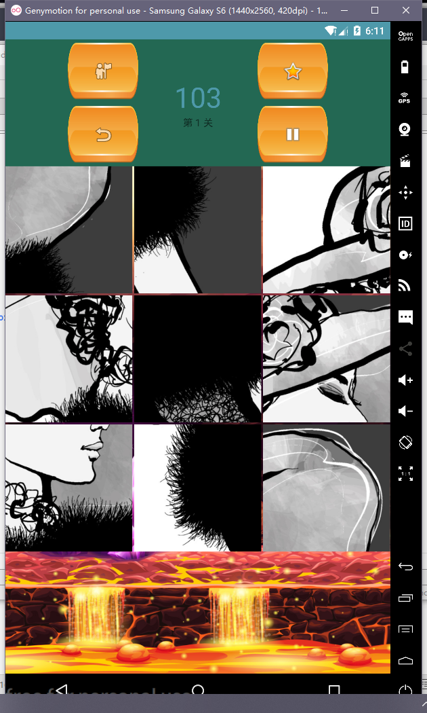

### puzzle
Android拼图游戏，使用Android studio运行源代码



# version

```
android {
    compileSdkVersion 28
    defaultConfig {
        applicationId "com.game.puzzle"
        minSdkVersion 14
        targetSdkVersion 26
        versionCode 1
        versionName "1.0"
        testInstrumentationRunner "android.support.test.runner.AndroidJUnitRunner"
    }
    buildTypes {
        release {
            minifyEnabled false
            proguardFiles getDefaultProguardFile('proguard-android.txt'), 'proguard-rules.pro'
        }
    }
    productFlavors {
    }
    buildToolsVersion '28.0.3'
}
```

